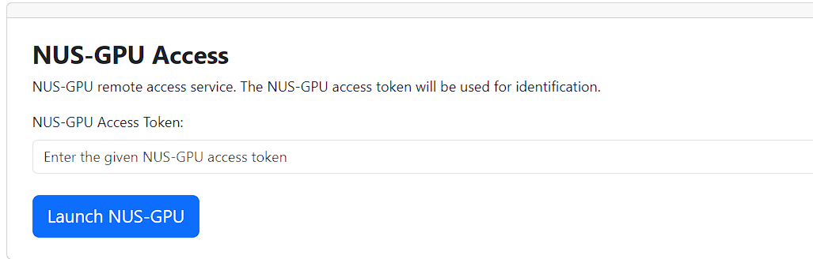
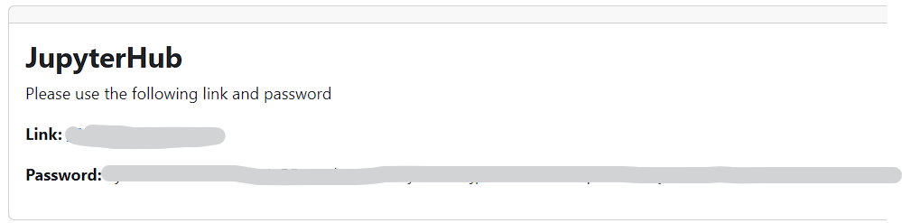

# AEEE-Summer School GPU Camp

This is a repository to deliver the 2024 GPU Camp Training Material on Aug 6-8, 2024. Please DO NOT distribute this document for any commercial purposes.

## Agenda

| Date  | Time        | Activity                                                                                                                | Resource                                                                                                                                                                                                           |
| ----- | ----------- | ----------------------------------------------------------------------------------------------------------------------- | ------------------------------------------------------------------------------------------------------------------------------------------------------------------------------------------------------------------ |
| 6-Aug | 9:30-10:30  | AMD AI Solution and Radeon GPU AI demo, Training with ROCm/Pytorch                                                      |                                                                                                                                                                                                                    |
|       | 10:30-11:30 | Deploy LLM and RAG with Radeon GPU                                                                                      | [Play with rocm](https://github.com/alexhegit/Playing-with-ROCm/tree/main); [Deploy LLM with ollama](https://github.com/ollama/ollama/blob/main/docs/linux.md)                                                           |
|       | 14:00-17:00 | Design your own AI Agent with Infini-AI                                                                               | [Infini AI](https://cloud.infini-ai.com/platform/ai)                                                                                                                                                     |
|       |             |                                                                                                                         |                                                                                                                                                                                                                    |
| 7-Aug | 9:30-10:30  | ROCm and HIP from scratch                                                                                               |                                                                                                                                                                                                                    |
|       | 10:30-11:30 | HIP program model; Structure of HIP code; HIP error checking; Timing HIP codes Shared memory; CUDA-to-HIP translations; | [HIP program model](https://rocm.docs.amd.com/projects/HIP/en/latest/understand/programming_model.html); [HIP documentation](https://rocm.docs.amd.com/projects/HIP/en/latest/index.html);                               |
|       | 14:00-17:00 | Lab Time                                                                                               | [RAG notebooks](./lab2_RAG/lab2_rag_langchain.ipynb); [ ROCm/HIP notebooks](./lab1_introduction_to_hip/lab1_hip_exercises.ipynb)                                                                                                                                            |
|       |             |                                                                                                                         |                                                                                                                                                                                                                    |
| 8-Aug | 9:30-10:30  | Case study: Optimize the LLM on Radeon GPU with HIP                                                                     |                                                                                                                                                                                                                    |
|       | 10:30-11:30 | CCF-CCC challenge Winner Sharing, LLM Optimization                                                                      | [CCF challenge](https://ccf-tcarch-ccc.github.io/2024/); [How to profile a HIP program](https://www.amd.com/content/dam/amd/en/documents/developer/webinars/rocm/profiling-and-performance-topics-for-amd-cdna-gpus.pdf) |
|       | 14:00-16:00 | Lab Time                                                                               | [RAG notebooks](./lab2_RAG/lab2_rag_langchain.ipynb); [ ROCm/HIP notebooks](./lab1_introduction_to_hip/lab1_hip_exercises.ipynb)                                                                                                                                                                  |
|       | 16:00-17:00 | Home Work                                                                                                               |                                                                                                                                                                                                                    |

## Remote Lab Access

You can follow the steps below to access to our remote lab:

1. Open your browser and type **http://111.229.117.44:8991/signin/** to login in. If you have not registered yet, choose "sign up here" to register your account.
2. Choose **NUS-GPU Access**. Login in with your access token.
   
3. Enter the jupyter hub with your link and password.
   
4. Choose **"AMD GPU"** for Lab1 and **"RAG"** for Lab2.
   
5. Start playing.

## Homework

### Lab1: HIP programing introduction

In this lab, we will not only delve deeply into the programming techniques of AMD GPUs, but also guide you through practice to master the AMD GPU programming model HIP (Heterogeneous-Compute Interface for Portability). Our goal is to start from the basic concepts, gradually build a profound understanding of HIP program development, and ultimately enable you to independently write and run your own HIP programs.

#### Homeworks

Finish the exercises in [[exercises]](introduction_to_hip/exercises/): 
    [01_error_check](introduction_to_hip/exercises/01_error_check/) 
    [02_add_d2h_data_transfer](introduction_to_hip/exercises/02_add_d2h_data_transfer/) 
    [03_complete_square_elements](introduction_to_hip/exercises/03_complete_square_elements/) 
    [04_complete_matrix_multiply](introduction_to_hip/exercises/04_complete_matrix_multiply/) 
    [05_compare_with_library](introduction_to_hip/exercises/05_compare_with_library/) 
    [06_hipify_pingpong](introduction_to_hip/exercises/06_hipify_pingpong/) 
    [07_matrix_multiply_shared](introduction_to_hip/exercises/07_matrix_multiply_shared/)

### Lab2: A simple RAG system

In this lab, we will explore how to use LLMs to transform documents into knowledge and build your own local knowledge base. You will learn how to construct a local knowledge base and how to gradually build a simple RAG (Retrieval-Augmentation Generation) system, which can generate question-and-answer responses based on local documents, making the LLMs generate more trustful content.

#### Homeworks

1. Change the query prompt in **Step 3. Build RAG chain** to make the llm RAG system response in json format.
2. Replace the the input documentation in **Step 2. Indexing your file** with your own documentation；
3. (Adavanced) Is there a better way to improve the performance of RAG system ?

## Submission

* Deadline: 18th Aug
* Submission format:
  * Download the Jupyter Notebook and send the notebook file through e-mail.
* E-mail Notification: aeee-sc@qq.com
  * Name, School, Cell Phone number should be provided in the e-mail.

## Addition meterial

[[Langchain]](https://github.com/langchain-ai/langchain) \
[[ROCm documentation]](https://hipfft.readthedocs.io/en/rocm-6.1.2/index.html) \
[[HIP documentation]](https://rocm.docs.amd.com/projects/HIP/en/latest/) \
[[PowerInfer]](https://github.com/SJTU-IPADS/PowerInfer) \
[[ollama]](https://ollama.com/) \
[[Infini AI]](https://cloud.infini-ai.com/platform/ai) \
[[GPU CAMP Remote LAB]](http://111.229.117.44:8991/signin/) \
